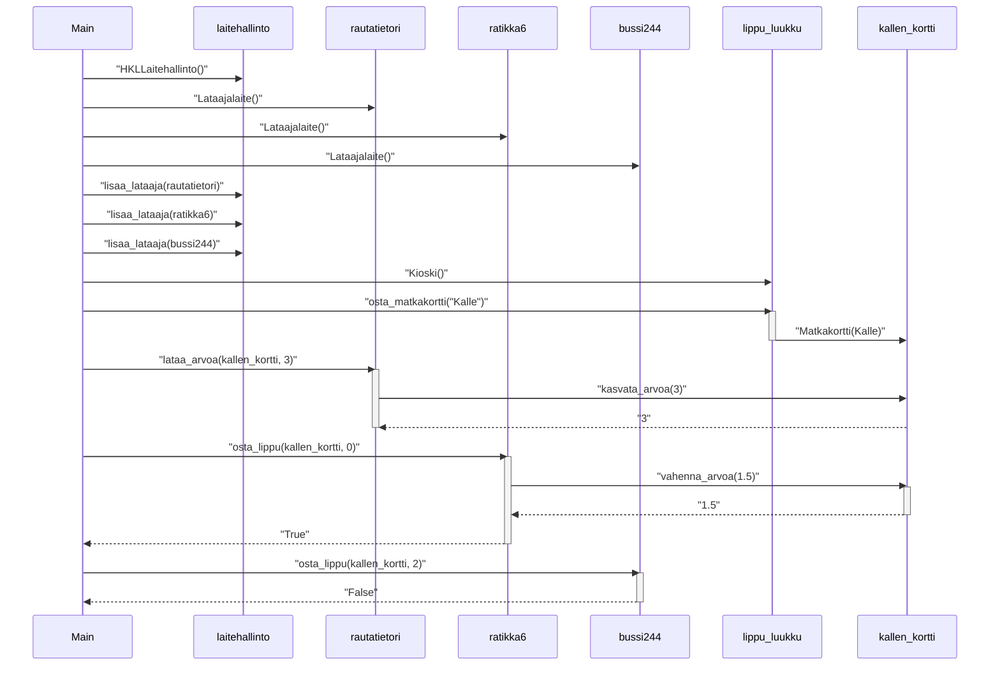

```mermaid
sequenceDiagram
  Main ->> laitehallinto: "HKLLaitehallinto()"

  Main ->> rautatietori: "Lataajalaite()"
  Main ->> ratikka6: "Lataajalaite()"
  Main ->> bussi244: "Lataajalaite()"
  
  Main ->> laitehallinto: "lisaa_lataaja(rautatietori)"
  Main ->> laitehallinto: "lisaa_lataaja(ratikka6)"
  Main ->> laitehallinto: "lisaa_lataaja(bussi244)"
  
  Main ->> lippu_luukku:"Kioski()"
  
  Main ->> lippu_luukku: "osta_matkakortti("Kalle")"
  activate lippu_luukku
  
  lippu_luukku ->> kallen_kortti: "Matkakortti(Kalle)"
  
  deactivate lippu_luukku

  Main ->> rautatietori: "lataa_arvoa(kallen_kortti, 3)"
  activate rautatietori
  rautatietori ->> kallen_kortti: "kasvata_arvoa(3)"
  kallen_kortti -->> rautatietori: "3"
  deactivate rautatietori
  
  Main ->> ratikka6: "osta_lippu(kallen_kortti, 0)"
  activate ratikka6
  ratikka6 ->> kallen_kortti: "vahenna_arvoa(1.5)"
  activate kallen_kortti
  kallen_kortti -->> ratikka6: "1.5"
  deactivate kallen_kortti
  ratikka6 -->> Main: "True"
  deactivate ratikka6
  
  Main ->> bussi244: "osta_lippu(kallen_kortti, 2)"
  activate bussi244
  bussi244 -->> Main: "False"
  deactivate bussi244
  


```
