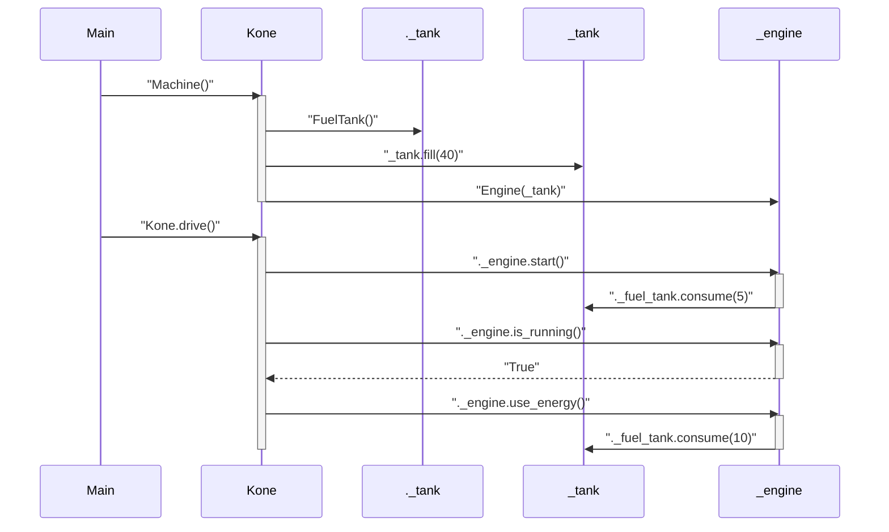

```mermaid

sequenceDiagram
  Main ->> Kone: "Machine()"
  activate Kone
  Kone ->> ._tank: "FuelTank()"

  Kone ->> _tank: "_tank.fill(40)" 
  
  Kone ->> _engine: "Engine(_tank)"
  
  deactivate Kone
  
  Main ->> Kone: "Kone.drive()"
  
  activate Kone
  Kone ->> _engine: "._engine.start()"
  
  activate _engine
  _engine ->> _tank: "._fuel_tank.consume(5)"

  
  
  deactivate _engine
  
  
  Kone ->> _engine: "._engine.is_running()"
  activate _engine
  _engine -->> Kone: "True" 
  
  deactivate _engine
  
  Kone ->> _engine: "._engine.use_energy()"
  activate _engine
  _engine ->> _tank: "._fuel_tank.consume(10)" 
  
  deactivate _engine
  
  deactivate Kone
  
  
  
```
