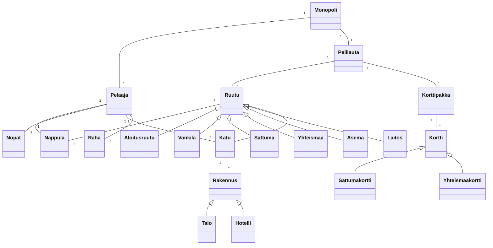

```mermaid
classDiagram
  Monopoli "1" -- "*" Pelaaja
  Monopoli "1" -- "1" Pelilauta

  Pelaaja "1" -- "1" Nappula
  
  
  Pelilauta "1" -- "*" Ruutu
  
  Ruutu "1" -- "*" Nappula
  
  
  Pelaaja "*" -- "1" Nopat
  
  
  Ruutu <|-- Aloitusruutu
  Ruutu <|-- Vankila
  Ruutu <|-- Sattuma
  Ruutu <|-- Yhteismaa
  Ruutu <|-- Asema
  Ruutu <|-- Laitos
  Ruutu <|-- Katu
  
  Pelilauta "1" -- "*" Korttipakka


  Korttipakka "1" -- "*" Kortti
  Kortti <|--  Sattumakortti
  Kortti <|--  Yhteismaakortti
  
  Katu "1" -- "*" Rakennus
  
  Rakennus <|-- Talo
  Rakennus <|-- Hotelli
  
  Pelaaja "1" -- "*" Katu
  
  Pelaaja "1" -- "*" Raha


```
