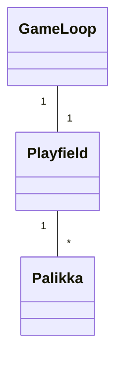
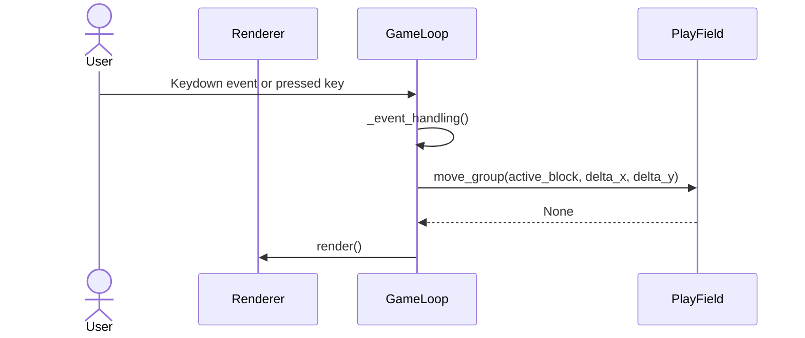

## Luokkakaavio?

Playfield huolehtii pelialueesta ja pelialueella sijaitsevista palikoista.

## Päätoiminnallisuudet
Joitain ohjelman päätoiminnallisuuden sekvenssiokaavioita

### palikan liikuttaminen

