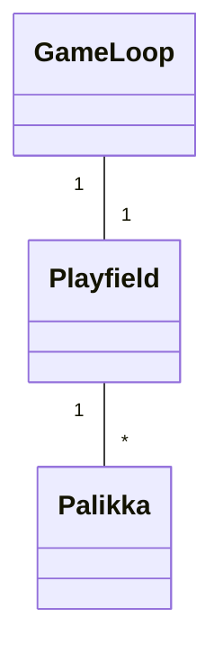
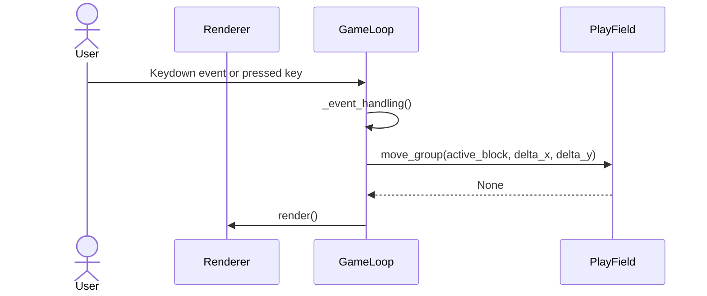
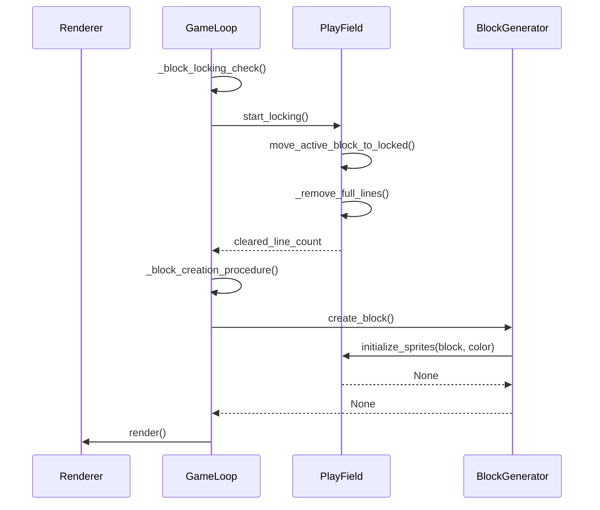
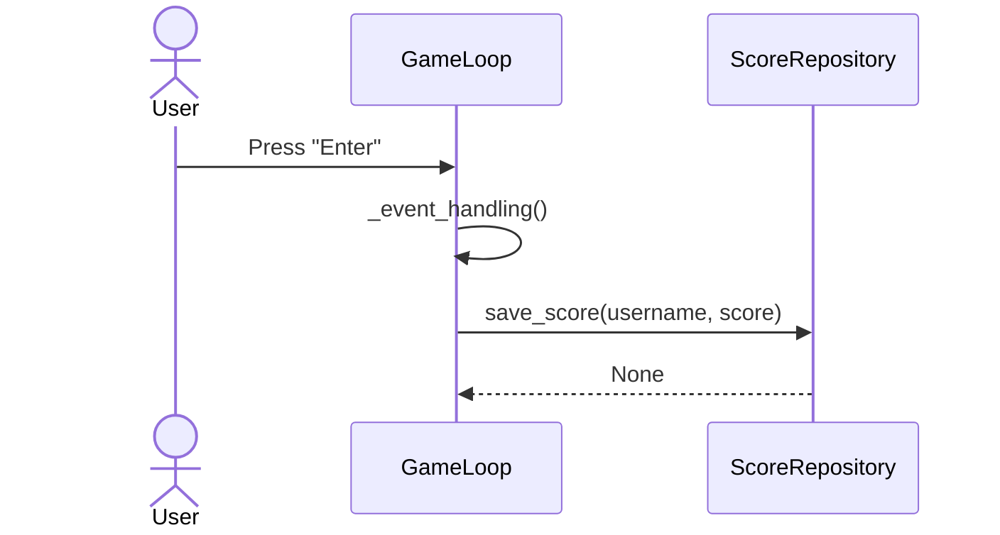

# Arkkitehtuurikuvaus
## Rakenne 

_ui_ sisältää käyttöliittymästä, _game_logic_ sovelluslogiikasta ja _score_database_ tietojen pysyväistallennuksesta vastaavan koodin. Pakkaus _sprites_ sisältää luokkia, jotka kuvastavat sovelluksen käyttämiä spritejä.

## Käyttöliittymä
Käyttöliittymässä on pelinäkymä ja pelin loputtua pelinäkymän päälle lisätään huipputulokset ja tuloksen tallennus

Käyttöliittymästä huolehtii _Renderer_-luokka. Käyttöliittymä on pyritty eristämään mahdollisimman hyvin pelilogiikasta. Eristys voisi olla parempi.

## Luokkakaavio?

Playfield huolehtii pelialueesta ja pelialueella sijaitsevista palikoista.

## Tietojen pysyväistallennus
Pakkauksen _score_database_ luokka `ScoreRepository` huolehtii tietojen tallettamisesta

Pelaajan tulokset tallennetaan SQLite-tietokannan `scores` tauluun.

scores tauluun tallennetaan pelaajan saavuttama pistemäärä ja syöttämä nimimerkki.

## Päätoiminnallisuudet
Joitain ohjelman päätoiminnallisuuden sekvenssiokaavioita

### palikan liikuttaminen

### palikan lukitseminen ja uuden palikan luonti

### tuloksen tallennus

